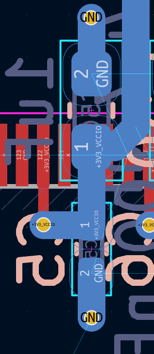
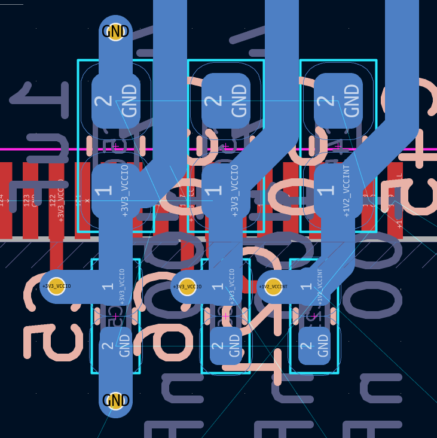
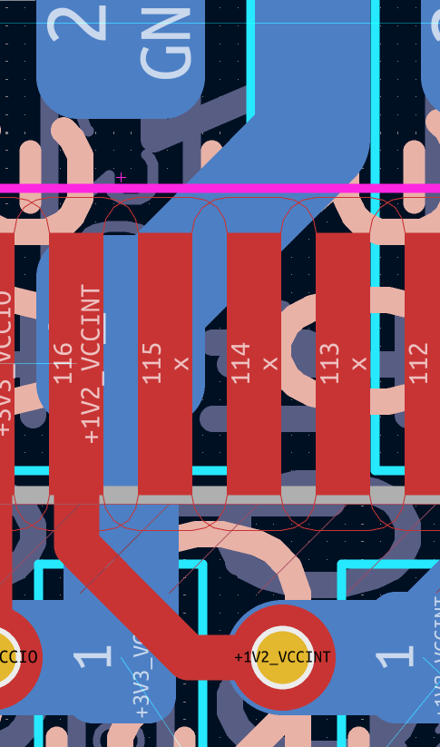

## Многокритериальная параметрическая оптимизация топологии цепей питания (PDN) микросхем высокой плотности

## Введение

В современном проектировании высокоскоростных цифровых устройств критически важной задачей является обеспечение целостности питания (Power Integrity, PI) микросхем с высокой плотностью выводов (таких как FPGA/BGA). Стабильность работы кремниевого кристалла напрямую зависит от паразитной индуктивности и сопротивления цепей питания (PDN), что требует размещения каскадов блокировочных конденсаторов в непосредственной близости от выводов микросхемы.
С ростом плотности компоновки и увеличением количества разнородных питающих напряжений $(\text{VCC\_INT}, \text{VCCIO}, \text{VCCD\_PLL})$ традиционная ручная трассировка топологии неизбежно приводит к пространственным конфликтам («толчее» компонентов и переходных отверстий).
Для автоматизации этого процесса и поиска глобально оптимального расположения элементов разработана математическая модель, в основе которой лежит задача геометрической оптимизации связных графов в условиях нелинейных ограничений-неравенств. В рамках данной модели каждая «спица» питания (каскад из конденсаторов разной емкости, переходных отверстий и выводов FPGA) представляется в виде ориентированного графа с заданными приоритетами (весами пружин) для каждого ребра.
Целевая функция алгоритма направлена на минимизацию суммарной длины критических проводников. При этом технологические зазоры (DRC) и фиксированные размеры посадочных мест компонентов формируют систему жестких нелинейных ограничений, основанных на евклидовых расстояниях. Разработанный подход позволяет автоматически синтезировать симметричную, компактную и помехозащищенную топологию печатной платы с учетом специфики и физических ограничений каждой конкретной питающей цепи.

## Описание



На изображении показан фрагмент топологии печатной платы (PCB) в специализированной программе для проектирования электроники (CAD). Стоит отметить, что картинка перевернута "вверх ногами" (текст отображается в зеркальном и перевернутом виде).

## Основные элементы на схеме

* SMD-компоненты (конденсаторы): В центре расположены посадочные места двух пассивных компонентов (вероятно, блокировочных конденсаторов C21 и C22).
* Контакты и цепи питания:
* Выводы под номером 1 подключены к шине питания +3V3_VCCIO (3.3 Вольта).
   * Выводы под номером 2 подключены к полигону заземления GND (Земля).
* Микросхема (FPGA / BGA): Слева и справа видны ряды выводов (пинов) большой микросхемы. На них указаны номера выводов (например, 122, 123, 124) и названия других цепей питания, таких как +1V2_VCCINT (1.2 Вольта) и +3V3_VCC.
* Трассировка проводников: Голубым цветом выделены дорожки и переходные отверстия (vias), соединяющие выводы конденсаторов с линиями питания и заземления.
* Т.е. внешняя линия питания приходит на «тяжёлый» конденсатор — 4.7 uF. Во внутренней части дворика FPGA (оба конденсатора на обратной стороне платы) стоит «лёгкий» конденсатор 100 nF. Линия питания через пад 100 nF, переходит через Via на F.Cu и отдаётся паду питания FPGA (с понижением толщины дорожки)
* Условно такую конструкцию можно назвать «спицей» (Spoke). Этого термина будем придерживаться и дальше.

### Топология («спицы»)

* Каскад емкостей: На входе «спицы» (снаружи дворика) стоит «тяжелый» конденсатор 4.7 мкФ. Он работает как локальный резервуар энергии, сглаживая низкочастотные просадки. Ближе к выводу FPGA (внутри дворика) стоит быстрый 100 нФ, который фильтрует высокочастотные помехи.
* Минимизация индуктивности: Размещение обоих конденсаторов на обратной стороне платы (B.Cu) прямо под выводами — это лучшее решение для уменьшения паразитной индуктивности дорожек.
* Спицевидная структура: Такая геометрия минимизирует длину проводников от фильтра до вывода питания микросхемы, что критично для стабильности работы ядер и портов ввода-вывода (VCCIO).

#### Проектирование платы

При проектировании платы для Intel Cyclone 10 LP (10CL006YE144), надо так же учесть два момента на финальном этапе:

   1. Диаметр VIA: Переходное отверстие, через которое линия уходит на верхний слой (F.Cu) к паду FPGA, должно иметь достаточный диаметр и металлизацию. Для цепей питания лучше использовать чуть более широкие отверстия (или два маленьких рядом), чтобы снизить их собственное сопротивление и индуктивность.
   2. Ширина «горловины»: Заужение дорожки между конденсатором 100 нФ и переходным отверстием к FPGA необходимо проверять. Она должна быть максимально широкой, насколько позволяют зазоры (clearance).


С учётом того, что 10CL006YE144C8G требует 4 различных вида питания — 3.3В, две линии 1.2В (INT, PLL) и 2.5В — VCCA когда приходится располагать целую серию таких «спиц» на плате, между компонентами начинается «толчея»

На рисунке хорошо видно, что Via `+1V2_VCCINT` сместилась вправо.




Разводка 40 конденсаторов вручную, с соблюдением всех правил может занимать до двух часов довольно напряжённой работы.

### Дополнительные условия

Сформировать алгоритм автоматического размещения конденсаторов и переходных отверстий так, чтобы:

1. У каждого GND-пада конденсатора тоже должна быть Via.
2. Цепь должна быть именно такова: приходим питанием на «толстый» конденсатор, с него на «тонкий» с него на Via, с Via переходим на нужный пад FPGA.
3. Желательно чтобы конденсаторы, Via располагались «красиво» (или на одной линии или в шахматном порядке)
4. Дорожки между конденсаторами в спице и Via питания должны быть максимально короткими («резинки», причём, чем тоньше дорожка, тем выше жёсткость «резинки» (тем она должна быть короче))
Приоритет по наименьшей длине, очевидно, должен быть у красной дорожки — от Via к паду CL-ки.

Надо найти математику, которая сможет хорошо описать такую конструкцию для расчёта положений спиц и компонент внутри спицы.

# Учесть
   1. Замену модулей на гладкие квадраты расстояний.
   2. Снятие жесткой коллинеарности по оси $X$ в пользу «мягкого» штрафа.
   3. Честный расчет диагоналей в «Сценарии А» (без обнуления $\Delta Y$).
   4. Внедрение замкнутой GND-петли возвратного тока.
   5. Отказ от жадной стратегии в пользу одновременной многокритериальной оптимизации.
   6. [Новое] Жесткие ограничения на запрет наложения сквозных Via на любые дорожки и чужие пады (на всех слоях), а также запрет слияния падов соседних компонентов.

## Описание базовой топологии «спицы» (Spoke)
Каждая индивидуальная спица питания реализует классический и наиболее эффективный каскадный фильтр:

```text
[Входящая линия питания] 
       │
       ▼
┌──────────────┐      ┌──────────────┐      ┌─────────────┐      ┌───────────┐
│ «Тяжёлый»    │ ───> │ «Лёгкий»     │ ───> │ Power Via   │ ───> │ Пад пина  │
│ конд. 4.7 uF │      │ конд. 100 nF │      │ (Слой B.Cu) │      │ FPGA      │
└──────────────┘      └──────────────┘      └─────────────┘      └───────────┘
       │                     │                     │              (Слой F.Cu)
       ▼                     ▼                     ▼
┌──────────────┐      ┌──────────────┐      ┌─────────────┐
│  GND Pad 2   │      │  GND Pad 2   │      │   GND Via   │
└──────────────┘      └──────────────┘      └─────────────┘
       │                     │                     │
       └─────────────────────┴─────────────────────┴─> [Опорный слой Земли]
```

* Каскад емкостей: На входе спицы (снаружи дворика FPGA) стоит тяжелый конденсатор 4.7 мкФ, работающий как локальный резервуар энергии для сглаживания низкочастотных просадок. Ближе к выводу FPGA (внутри дворика) располагается быстрый конденсатор 100 нФ для фильтрации высокочастотных помех. Оба компонента монтируются на обратной стороне платы (слой B.Cu) прямо под выводами микросхемы для минимизации индуктивности проводников.
* Трассировка и Via: Линия питания проходит через пады конденсаторов, уходит сквозь плату с помощью переходного отверстия питания (Power Via) на верхний слой (F.Cu) и отдается целевому паду FPGA с контролируемым локальным уменьшением («горловиной») толщины дорожки.

При последовательном размещении серии таких спиц под корпусами типа EQFP-144 (шаг пинов $P_{pitch} = 0.5 \text{ мм}$) их физические габариты (ширина пада 0402 $\approx 0.6 \text{ мм}$, диаметр Via $\approx 0.5 \text{ мм}$) делают строго параллельную разводку невозможной ($0.6 \text{ мм} + \text{зазор} > 0.5 \text{ мм}$). Элементы вынуждены смещаться, образуя «толчею» и нарушая геометрию соседних трасс.

------------------------------

## Формальная математическая модель оптимизации

Для устранения «жадных» ошибок и заклинивания алгоритма при пошаговом расчете, задача решается одновременно (глобально) для всего массива спиц $N$ с представлением гладкой целевой функции и точной матрицы ограничений.

## 1. Единый вектор оптимизируемых переменных $\mathbf{X}$

Все искомые координаты элементов собираются в один монолитный вектор состояния $\mathbf{X} \in \mathbb{R}^{8N}$:

$$\mathbf{X} = \begin{bmatrix} \mathbf{x}_{1} & \mathbf{x}_{2} & \dots & \mathbf{x}_{N} \end{bmatrix}^T$$ 

Где блок координат для каждой спицы $i$ содержит 8 вещественных переменных центров элементов на плоскости платы:

$$\mathbf{x}_{i} = \begin{bmatrix} x_{v,i}, & y_{v,i}, & x_{g,i}, & y_{g,i}, & x_{c1,i}, & y_{c1,i}, & x_{c2,i}, & y_{c2,i} \end{bmatrix}$$ 

* $V_i = (x_{v,i}, y_{v,i})$ — центр Power Via.
* $G_i = (x_{g,i}, y_{g,i})$ — центр GND Via.
* $C_{1,i} = (x_{c1,i}, y_{c1,i})$ — центр питающего пада малого конденсатора (100 нФ).
* $C_{2,i} = (x_{c2,i}, y_{c2,i})$ — центр питающего пада тяжелого конденсатора (4.7 мкФ).

Координаты целевых падов FPGA $F_i = (x_{f,i}, y_{f,i})$ жестко заданы геометрией корпуса ($x_{f,i} = i \cdot P_{pitch}, y_{f,i} = 0$).

## 2. Классификация цепей и направления развития

Каждому индексу спицы $i$ сопоставлен маркер типа питания $T_i \in \{1, 2, 3, 4\}$, определяющий вектор смещения по оси $Y$ через функцию направления $Sgn(T_i)$:

* Внутрь дворика FPGA ($Y > 0$): $T_i = 1 \implies \text{VCC\_INT}$ (ядро) и $T_i = 2 \implies \text{VCCD\_PLL}$ (цифровое PLL). Требуют наименьшей индуктивности.
* Наружу от дворика ($Y < 0$): $T_i = 3 \implies \text{VCCA}$ (аналог) и $T_i = 4 \implies \text{VCCIO}$ (периферия 3.3В). Относительно помехоустойчивые или «грязные» силовые цепи.

## 3. Гладкая целевая функция (Минимизация стоимости)

Для обеспечения устойчивости градиентных методов (SQP) модули заменены на квадраты евклидовых расстояний. Функция стоимости минимизирует длины проводников-«резинок», учитывает петлю заземления и накладывает мягкий штраф за отклонение от осевой симметрии:

$$\mathcal{F}(\mathbf{X}) = \sum_{i=1}^{N} \left( E_{\text{route}, i} + E_{\text{gnd\_loop}, i} + E_{\text{collinear}, i} \right) \to \min$$ 

## А. Энергия трассировки линии питания ($E_{\text{route}, i}$):

Зависит от динамического веса $w(T_i)$, определяемого иерархией жесткости цепей ($\text{VCCD\_PLL} > \text{VCC\_INT} > \text{VCCA} > \text{VCCIO}$). Чем тоньше вынужденный шаг дорожки, тем выше жесткость пружины:

$$E_{\text{route}, i} = w_{fv}(T_i) \cdot \Vert{}F_i - V_i\Vert{}^2 + w_{vc}(T_i) \cdot \Vert{}V_i - C_{1,i}\Vert{}^2 + w_{cc}(T_i) \cdot \Vert{}C_{1,i} - C_{2,i}\Vert{}^2$$ 

## Б. Энергия GND-петли возвратного тока ($E_{\text{gnd\_loop}, i}$):

Удерживает переходное отверстие земли максимально близко к блокирующей емкости для замыкания ВЧ-токов:

$$E_{\text{gnd\_loop}, i} = w_{gnd} \cdot \Vert{}G_i - C_{1,i}\Vert{}^2$$ 

## В. Мягкая коллинеарность ($E_{\text{collinear}, i}$):

Вместо жесткой фиксации $x = x_f$ алгоритму разрешено отклоняться по оси $X$ во избежание тупиков, но с квадратичным штрафом за потерю визуальной линейности («красоты») спицы:

$$E_{\text{collinear}, i} = w_{coll} \cdot \left[ (x_{v,i} - x_{f,i})^2 + (x_{c1,i} - x_{f,i})^2 + (x_{c2,i} - x_{f,i})^2 \right]$$ 

------------------------------

## Система жестких ограничений-неравенств $\mathbf{h}(\mathbf{X}) \ge 0$

Любое технологическое нарушение (DRC) должно возвращать отрицательное значение, блокируя недопустимый шаг оптимизатора. В отличие от упрощенных моделей, любые диагональные расстояния проверяются честно на всех слоях печатной платы.

## 1. Запрет слияния и наложения падов компонентов

Пады соседних спиц (как конденсаторов на слое B.Cu, так и падов микросхемы на слое F.Cu) не могут пересекаться и должны соблюдать номинальный технологический зазор $S$:
$$h_{\text{pad-pad}}(i, j) = (x_{c1,i} - x_{c1,j})^2 + (y_{c1,i} - y_{c1,j})^2 - (2W_{cap} + S)^2 \ge 0, \quad \forall i \neq j$$ 

## 2. Межслойная защита: Запрет наложения сквозных Via на чужие пады

Поскольку Via прошивает плату насквозь, координаты переходных отверстий питания $V_i$ и земли $G_i$ (даже расположенных на слое B.Cu) не должны геометрически пересекаться с фиксированными планарными падами FPGA $F_j$ на верхнем слое (F.Cu) или падами конденсаторов $C_j$ на нижнем слое:

$$h_{\text{via-fpga}}(i, j) = (x_{v,i} - x_{f,j})^2 + (y_{v,i} - y_{f,j})^2 - (R_{via} + W_{fpga} + S)^2 \ge 0, \quad \forall i, j$$ 
$$h_{\text{via-cap}}(i, j) = (x_{v,i} - x_{c1,j})^2 + (y_{v,i} - y_{c1,j})^2 - (R_{via} + W_{cap} + S)^2 \ge 0, \quad \forall i \neq j$$ 

(Исключение: разрешено легитимное взаимодействие компонентов внутри одной и той же собственной спицы, то есть при $i = j$ для связанных пар).

## 3. Ограничения на зазоры между сквозными Via и трассами

Сквозные переходные отверстия не должны приближаться к проводящим дорожкам питания шириной $W_p$ ближе, чем на величину зазора $S$:

$$h_{\text{via-route}}(i, j) = (x_{v,i} - x_{v,j})^2 + (y_{v,i} - y_{v,j})^2 - (2R_{via} + S)^2 \ge 0, \quad \forall i \neq j$$ 

## 4. Знакоопределенность и интервальные границы осей питания

Для гарантированного разведения разнородных цепей «вверх и вниз» задаются жесткие знаковые барьеры по оси $Y$:

$$\begin{cases} y_{*, i} \in [y_{min}, +\infty), & \text{если } T_i \in \{1, 2\} \,\, (\text{VCC\_INT}, \text{VCCD\_PLL}) \\ y_{*, i} \in (-\infty, -y_{min}], & \text{если } T_i \in \{3, 4\} \,\, (\text{VCCA}, \text{VCCIO}) \end{cases}$$ 

------------------------------

## Структура матрицы Якоби ограничений $\mathbf{J}_h(\mathbf{X})$

Для эффективной работы алгоритмов последовательного квадратичного программирования (SQP) и исключения численного дифференцирования, аналитический Якобиан ограничений формируется на основе простых линейных производных от квадратичных разностей. Для типового DRC-ограничения между абстрактными объектами $A$ и $B$:

$$h_k(\mathbf{X}) = (x_A - x_B)^2 + (y_A - y_B)^2 - D_{safe}^2 \ge 0$$ 

Строка Якобиана $\mathbf{J}_h$ для данного ограничения будет строго разреженной (Sparse), содержащей ненулевые частные производные исключительно в индексах, соответствующих координатам этих двух объектов:

$$\frac{\partial h_k}{\partial x_A} = 2(x_A - x_B), \quad \frac{\partial h_k}{\partial y_A} = 2(y_A - y_B)$$ 
$$\frac{\partial h_k}{\partial x_B} = -2(x_A - x_B), \quad \frac{\partial h_k}{\partial y_B} = -2(y_A - y_B)$$ 

## Практическая реализация

Возможно, представленная математическая нотация устраняет геометрические неоднозначности и готова к прямой имплементации в виде внешнего плагина автоматической трассировки для современных CAD-систем (например, скрипт на Python с использованием модуля scipy.optimize.minimize(method='SLSQP') для KiCad pcbnew API).
------------------------------
